# Processus RCL et Saisie d'Index

## Vue d'ensemble

La **Régularisation de Charges Locatives (RCL)** permet de calculer la répartition des charges d'un immeuble entre les différents lots (locataires) en fonction de leur consommation réelle.

## 1. Flux global : Saisie d'index → RCL

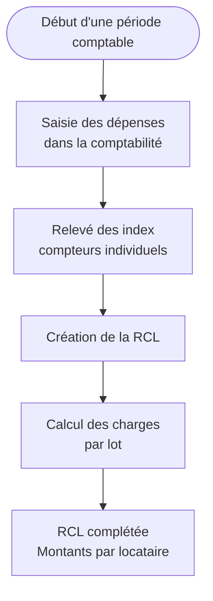

## 2. Saisie des index (Compteurs)

### Qu'est-ce qu'un index ?

Un **index** est une valeur de compteur relevée à un instant T :
- **Eau** : 123 m³
- **Gaz** : 456 m³
- **Chauffage** : 789 kWh

### Historique des relevés

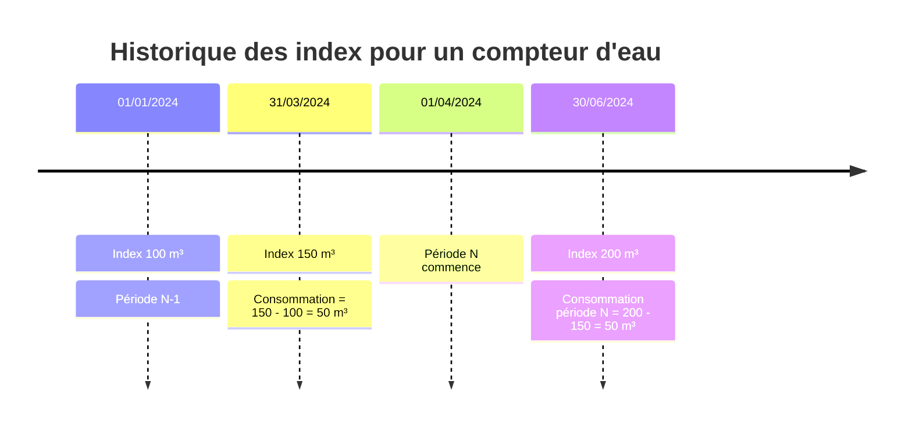

### Structure des données

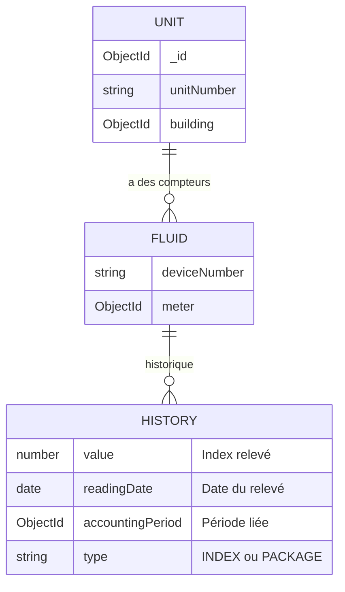

## 3. Clés de répartition (Allocation Keys)

### Principe

Une **clé de répartition** définit comment répartir une charge entre les lots d'un immeuble.

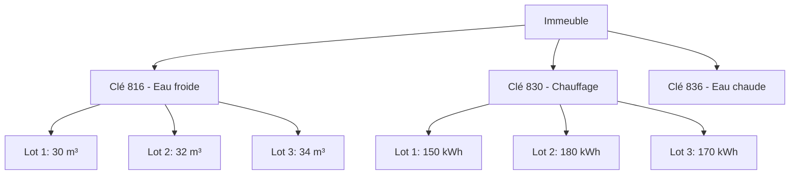

### Types de clés

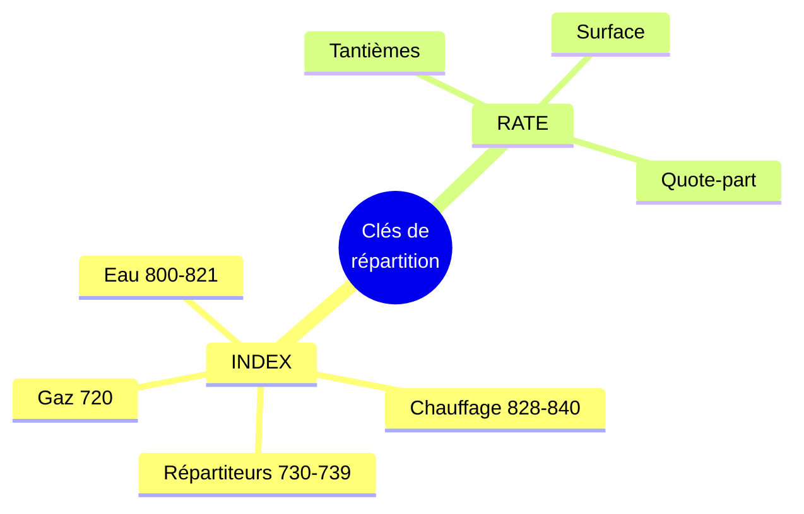

## 4. Calcul de la RCL - Cas normal

### Étape 1 : Récupération des données

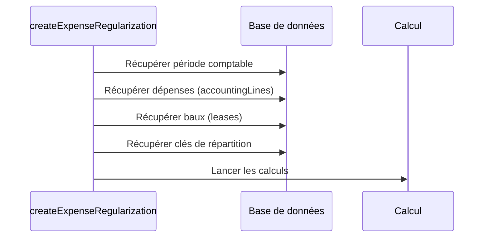

### Étape 2 : Calcul des consommations par clé INDEX

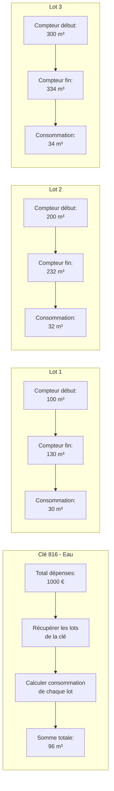

### Étape 3 : Répartition du montant

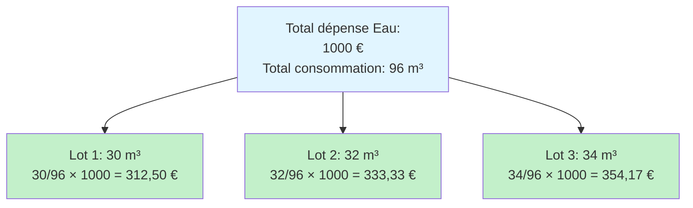

## 5. Cas spécial : Données perdues (PROD-27785)

### Problème

Parfois, les **index historiques ne sont plus en base** (migration, perte de données, etc.) mais on connaît les consommations réelles grâce à des documents papier.

### Solution : Script PData "Revue des Index"

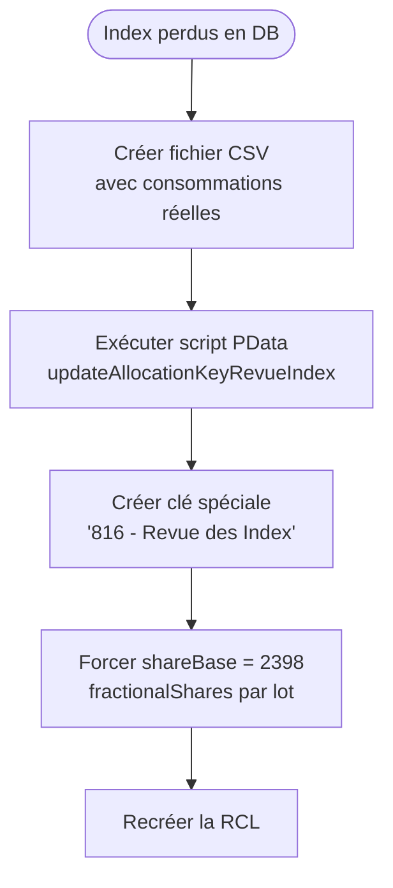

### Format CSV

```csv
building;Exercice;lot;compteur;index;consomation_totale;consomation_compteur
500181614;5f4fa08a67ab32b2d6684b84;1;710507103;816;2398;30
;;2;710644617;816;2398;32
;;3;7106444273;816;2398;34
```

**Signification:**
- `building`: Numéro d'immeuble
- `Exercice`: ID de la période comptable
- `lot`: ID du lot (coOwnershipBylawsId)
- `compteur`: Numéro de compteur (affichage)
- `index`: Numéro de la clé (816 = eau froide)
- `consomation_totale`: **Total immeuble forcé** (shareBase = 2398)
- `consomation_compteur`: **Consommation du lot forcée** (fractionalShares = 30)

### Clé PData créée

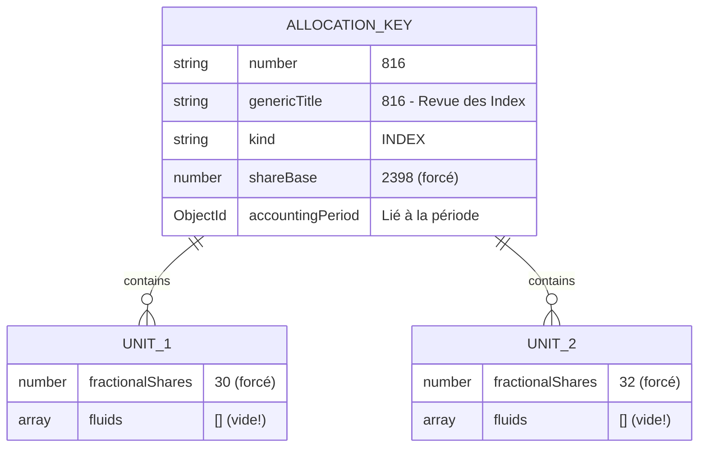

**Point clé:** Les `fluids` sont **vides**, seul `fractionalShares` est renseigné !

## 6. Routing automatique (PROD-27785)

### Détection et aiguillage

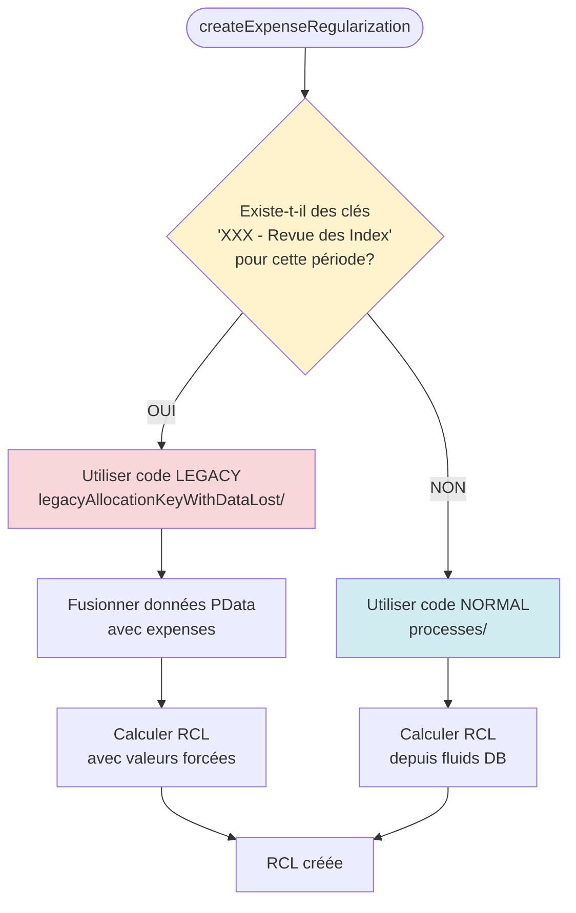

### Code de détection

```typescript
async function hasPdataRevueIndexKeys(
  accountingPeriodId: string,
  buildingId: string,
): Promise<boolean> {
  const pdataKeys = await AllocationKeyModel.find({
    building: buildingId,
    accountingPeriod: accountingPeriodId,
    genericTitle: { $regex: /- Revue des Index$/ }
  }).limit(1);

  return pdataKeys.length > 0;
}
```

## 7. Traitement Legacy - Fusion des données PData

### Étape 1 : Récupération des clés PData

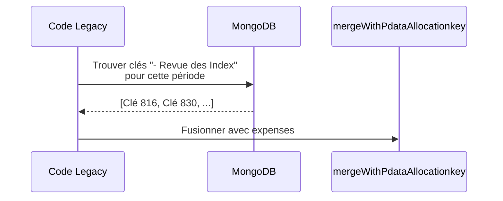

### Étape 2 : Fusion avec les expenses

```mermaid
flowchart LR
    subgraph "Expense original"
        E1[allocationKey.number = 816<br/>shareBase = calculé DB<br/>units avec fluids]
    end

    subgraph "Clé PData"
        P1[number = 816<br/>shareBase = 2398 forcé<br/>units avec fractionalShares]
    end

    subgraph "Expense fusionné"
        M1[allocationKey.number = 816<br/>shareBase = 2398 ✅<br/>units avec fractionalShares ✅<br/>fluids = [] ✅]
    end

    E1 --> Fusion{Merge}
    P1 --> Fusion
    Fusion --> M1

    style P1 fill:#fff3cd
    style M1 fill:#d4edda
```

### Étape 3 : Calcul avec valeurs forcées

**Dans `fluid.process.ts` (legacy):**

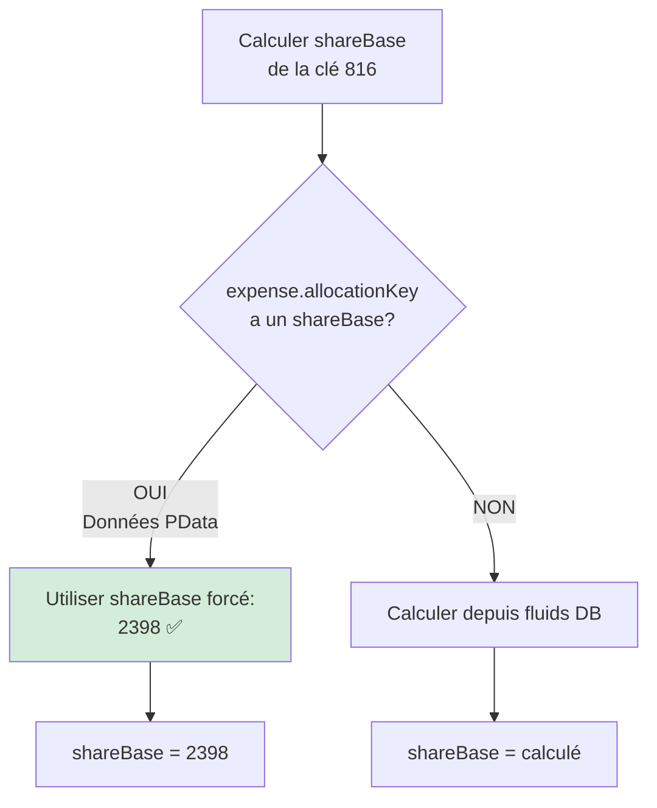

**Dans `expenseType.computation.ts` (legacy):**

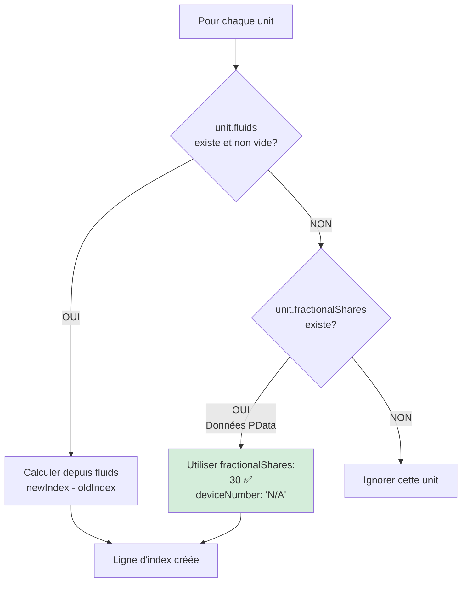

## 8. Résultat dans la RCL

### Vue dans l'interface

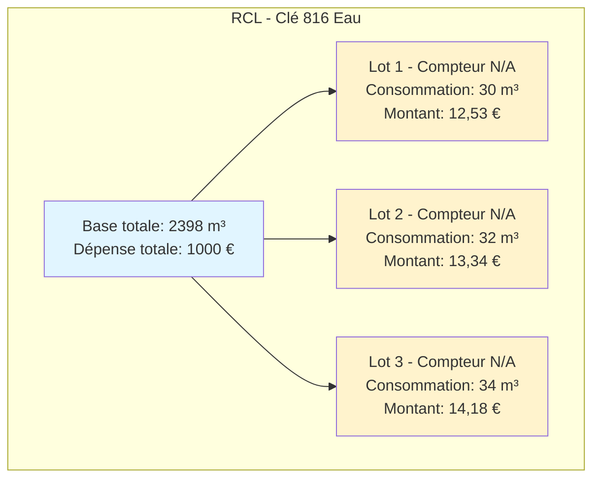

**Remarque:** Le compteur est "N/A" car il n'y a pas de compteur physique en DB, juste des valeurs forcées.

## 9. Schéma complet du flux PROD-27785

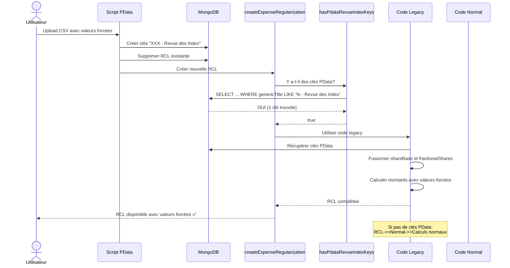

## 10. Avantages de cette architecture

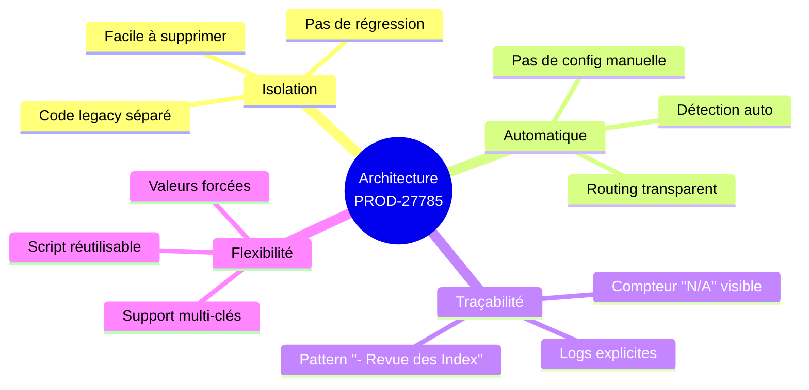

## 11. Résumé visuel

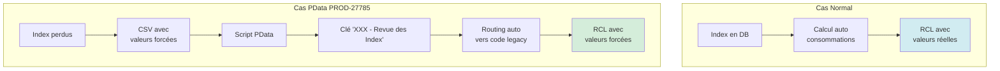

---

## Glossaire

- **RCL** : Régularisation de Charges Locatives
- **Index** : Valeur d'un compteur à un instant T
- **Clé de répartition** : Règle de calcul pour répartir une charge
- **ShareBase** : Total de la base de répartition (ex: total consommation immeuble)
- **FractionalShares** : Part d'un lot dans la base de répartition (ex: consommation du lot)
- **PData** : Script de données manuelles pour corriger/forcer des valeurs
- **Legacy** : Code ancien/spécifique conservé pour compatibilité
