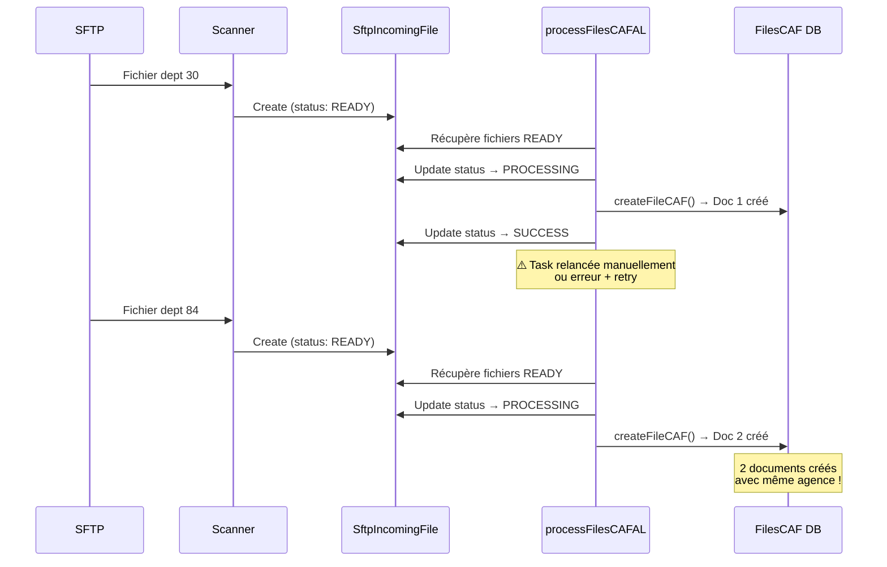

# 🐛 Analyse : Fusion de fichiers CAF dans MongoDB

> Pourquoi 2 fichiers CAF (même agence, départements différents) peuvent être intégrés dans la même ligne MongoDB

**Date** : 2025-11-20
**Problème** : Fichiers de départements différents fusionnés dans un seul document `FilesCAF`

---

## 🔍 Analyse du problème

### Situation observée

**Symptôme** :
- 2 fichiers CAF distincts avec la **même agence** mais des **départements différents**
- Les deux fichiers sont intégrés dans **la même ligne** de la collection `filesCAF`

**Exemple** :
```
Fichier 1 : CAFAL301_2025103090703_0601.txt
  • Agence : P8456 (Foncia Fabre Gibert)
  • Département : 30
  • Montant : 13 557,75 €

Fichier 2 : CAFAL841_2025103090710_0601.txt
  • Agence : P8456 (Foncia Fabre Gibert)
  • Département : 84
  • Montant : 152 367,02 €

Résultat MongoDB : 1 seul document au lieu de 2
```

---

## 🔎 Diagnostic

### 1. Absence d'index unique

**Code source** : `/applications/plato/src/models/accounting/filesCAF.ts`

```typescript
const fileCAFSchema = new Schema<FileCAFType>(
  {
    agency: {
      type: Schema.Types.ObjectId,
      ref: "Agency",
      required: true,
    },
    department: {
      type: String,
      required: true,
    },
    year: {
      type: Number,
      required: true,
    },
    month: {
      type: Number,
      required: true,
    },
    type: {
      type: String,
      required: true,
      enum: Object.values(fileCAFType),
      default: fileCAFType.AL,
    },
    // ...
  },
  { timestamps: true },
);

export const FilesCAFModel = mongoose.model<FileCAFType>(
  "FilesCAF",
  fileCAFSchema,
  "filesCAF",
);
```

**Problème** :
- ❌ **Aucun index unique** défini sur la combinaison `(agency, department, year, month, type)`
- ❌ Plusieurs documents peuvent avoir les mêmes valeurs pour ces champs
- ❌ MongoDB n'empêche pas la création de doublons

### 2. Méthode de création sans vérification

**Code source** : `/applications/plato/src/services/dao/cafFiles.dao.js`

```javascript
export async function createFileCAF(data) {
  try {
    const created = await FilesCAFModel.create(data);
    return created;
  } catch (error) {
    logger.error({ error }, "DAO-FileCAF-createFileCAF");
    throw errorHttpHandler(500, error.message);
  }
}
```

**Problème** :
- ❌ `FilesCAFModel.create(data)` crée **toujours** un nouveau document
- ❌ Aucune vérification d'existence avant insertion
- ❌ Pas d'utilisation de `findOneAndUpdate` avec `upsert: true`

### 3. Process de parsing

**Code source** : `/applications/plato/src/flux/caf/cafFiles.process.js`

```javascript
// Ligne 86
const created = await FileCAFDao.createFileCAF(fileCAFData);
```

**Flow** :
```
1. Scanner SFTP trouve fichier
2. SftpIncomingFile créé (status: READY)
3. Scheduled task processFilesCAFAL s'exécute
4. Parse le fichier → fileCAFData
5. createFileCAF(fileCAFData) → TOUJOURS CRÉE UN NOUVEAU DOC
```

---

## 🎯 Causes identifiées

### Cause racine 1 : Scheduled task exécuté plusieurs fois

**Scénario probable** :



### Cause racine 2 : Fusion manuelle ou script

**Scénario possible** :
- Un script de correction a fusionné les `cafTransfers` de 2 documents
- Mise à jour manuelle avec `updateOne` ou `updateMany`

---

## 💡 Solutions

### Solution 1 : Ajouter un index unique (RECOMMANDÉ)

**Fichier** : `/applications/plato/src/models/accounting/filesCAF.ts`

```typescript
const fileCAFSchema = new Schema<FileCAFType>(
  {
    // ... champs existants
  },
  { timestamps: true },
);

// Ajouter un index unique sur la combinaison naturelle
fileCAFSchema.index(
  { agency: 1, department: 1, year: 1, month: 1, type: 1 },
  { unique: true }
);

export const FilesCAFModel = mongoose.model<FileCAFType>(
  "FilesCAF",
  fileCAFSchema,
  "filesCAF",
);
```

**Migration à appliquer** :
```javascript
// Créer l'index unique
db.filesCAF.createIndex(
  { agency: 1, department: 1, year: 1, month: 1, type: 1 },
  { unique: true }
);
```

**Avant la migration, nettoyer les doublons** :
```javascript
// 1. Trouver les doublons
db.filesCAF.aggregate([
  {
    $group: {
      _id: {
        agency: "$agency",
        department: "$department",
        year: "$year",
        month: "$month",
        type: "$type"
      },
      count: { $sum: 1 },
      docs: { $push: "$$ROOT" }
    }
  },
  { $match: { count: { $gt: 1 } } }
]);

// 2. Décider comment fusionner/supprimer
// Option A : Garder le plus récent
// Option B : Fusionner les cafTransfers
// Option C : Garder celui avec status = PROCESSED
```

### Solution 2 : Utiliser upsert dans le DAO

**Fichier** : `/applications/plato/src/services/dao/cafFiles.dao.js`

```javascript
export async function createOrUpdateFileCAF(data) {
  try {
    const { agency, department, year, month, type } = data;

    // Vérifier si un document existe déjà
    const existing = await FilesCAFModel.findOne({
      agency,
      department,
      year,
      month,
      type,
    });

    if (existing) {
      logger.warn(
        { agency, department, year, month, type },
        'FileCAF already exists, updating instead of creating'
      );

      // Option 1 : Erreur
      throw errorHttpHandler(409, 'FileCAF already exists', {
        toJSON: true,
        data: { existingId: existing._id }
      });

      // Option 2 : Update (si on veut fusionner)
      // return FilesCAFModel.findByIdAndUpdate(
      //   existing._id,
      //   { $push: { cafTransfers: { $each: data.cafTransfers } } },
      //   { new: true }
      // );
    }

    const created = await FilesCAFModel.create(data);
    return created;
  } catch (error) {
    logger.error({ error }, "DAO-FileCAF-createOrUpdateFileCAF");
    throw error;
  }
}
```

### Solution 3 : Vérification dans le process

**Fichier** : `/applications/plato/src/flux/caf/cafFiles.process.js`

```javascript
async processFilesCAF(scheduledTaskName) {
  // ... code existant

  for (const fileDbDocument of filesDbDocuments) {
    try {
      // ... parsing du fichier

      // AJOUT : Vérifier si un document existe déjà
      const existingFileCAF = await FilesCAFModel.findOne({
        agency: fileCAFData.agency,
        department: fileCAFData.department,
        year: fileCAFData.year,
        month: fileCAFData.month,
        type: fileCAFData.type,
      });

      if (existingFileCAF) {
        logger.error(
          {
            fileName: fileDbDocument.originalFilename,
            existingId: existingFileCAF._id,
          },
          'FileCAF already exists, skipping creation'
        );

        // Marquer le fichier SFTP comme SUCCESS quand même
        await this._updateFileFromSftpStatus(
          fileDbDocument._id,
          status.SUCCESS,
        );

        continue; // Skip la création
      }

      // Create cafAlFile document
      const created = await FileCAFDao.createFileCAF(fileCAFData);

      // ... reste du code
    } catch (error) {
      // ...
    }
  }
}
```

---

## 🔍 Comment vérifier si vous avez des doublons

### Requête MongoDB

```javascript
// Trouver les doublons dans filesCAF
db.filesCAF.aggregate([
  {
    $group: {
      _id: {
        agency: "$agency",
        department: "$department",
        year: "$year",
        month: "$month",
        type: "$type"
      },
      count: { $sum: 1 },
      docs: { $push: { _id: "$_id", status: "$status", createdAt: "$createdAt" } }
    }
  },
  {
    $match: {
      count: { $gt: 1 }
    }
  },
  {
    $sort: { count: -1 }
  }
]);
```

### Requête pour votre cas spécifique

```javascript
// Chercher les fichiers de novembre 2025 pour agence P8456
db.filesCAF.aggregate([
  {
    $lookup: {
      from: "agencies",
      localField: "agency",
      foreignField: "_id",
      as: "agencyInfo"
    }
  },
  {
    $match: {
      year: 2025,
      month: 11,
      "agencyInfo.codeLessor": "P8456"
    }
  },
  {
    $project: {
      _id: 1,
      department: 1,
      type: 1,
      status: 1,
      amount: 1,
      "agencyInfo.officeName": 1,
      cafTransfersCount: { $size: "$cafTransfers" },
      createdAt: 1
    }
  },
  {
    $sort: { department: 1 }
  }
]);
```

---

## 📊 Recommandations

### Court terme (correction rapide)

1. **Identifier les doublons actuels**
   ```javascript
   db.filesCAF.aggregate([...]) // Requête ci-dessus
   ```

2. **Décider de la stratégie de fusion**
   - Garder le document le plus récent ?
   - Fusionner les `cafTransfers` ?
   - Supprimer les doublons si status = ERROR_AMOUNT ?

3. **Nettoyer manuellement**
   ```javascript
   // Exemple : supprimer le plus ancien si doublon
   db.filesCAF.deleteOne({ _id: ObjectId("...") })
   ```

### Moyen terme (prévention)

1. **Ajouter l'index unique** sur `(agency, department, year, month, type)`
   ```javascript
   db.filesCAF.createIndex(
     { agency: 1, department: 1, year: 1, month: 1, type: 1 },
     { unique: true }
   );
   ```

2. **Modifier le DAO** pour vérifier l'existence avant création

3. **Ajouter des tests** pour vérifier le comportement

### Long terme (robustesse)

1. **Refactoring du process de parsing**
   - Utiliser `findOneAndUpdate` avec `upsert: true`
   - Gérer explicitement les cas de doublons

2. **Monitoring**
   - Alertes sur création de doublons
   - Dashboard de suivi des fichiers CAF

3. **Documentation**
   - Documenter la clé naturelle unique
   - Procédure de résolution des doublons

---

## 🎓 Conclusion

### Le problème

**Absence d'index unique** dans le schéma MongoDB `filesCAF` permet la création de plusieurs documents avec :
- Même agence
- Même année/mois
- Même type (AL/APL)
- **Départements différents**

### La solution recommandée

1. ✅ **Ajouter un index unique** sur `(agency, department, year, month, type)`
2. ✅ **Nettoyer les doublons existants** avant d'appliquer l'index
3. ✅ **Modifier le DAO** pour gérer les cas de conflit
4. ✅ **Ajouter des logs** pour tracer les tentatives de création de doublons

### Impact

- ⚠️ **Migration requise** : nettoyage des doublons avant index
- ✅ **Prévention** : plus de doublons possibles
- ✅ **Cohérence** : 1 fichier CAF = 1 document MongoDB

---

**Fichiers à modifier** :
- `/applications/plato/src/models/accounting/filesCAF.ts` (ajouter index)
- `/applications/plato/src/services/dao/cafFiles.dao.js` (vérification existence)
- `/applications/plato/src/flux/caf/cafFiles.process.js` (gestion doublons)

**Tests à ajouter** :
- Test de création de doublon (doit échouer)
- Test de parsing du même fichier 2 fois (doit skip)
- Test de fusion de départements différents (doit créer 2 docs)
