# 🔄 Process d'intégration des fichiers CAF - Récapitulatif

> Documentation technique complète avec diagrammes Mermaid
> Date: 2025-11-20

---

## 📋 Table des matières

- [Vue d'ensemble](#vue-densemble)
- [Architecture globale](#architecture-globale)
- [Flux de traitement](#flux-de-traitement)
- [Modèle de données](#modèle-de-données)
- [Séquences détaillées](#séquences-détaillées)
- [Gestion des erreurs](#gestion-des-erreurs)
- [Points clés](#points-clés)

---

## 🎯 Vue d'ensemble

### Objectif
Intégrer les fichiers de versements CAF (Caisse d'Allocations Familiales) pour créer les virements et écritures comptables correspondantes.

### Types de fichiers
- **AL** (Aide au Logement) - Code `999`
- **APL** (Aide Personnalisée au Logement) - Code `900`

### Acteurs principaux
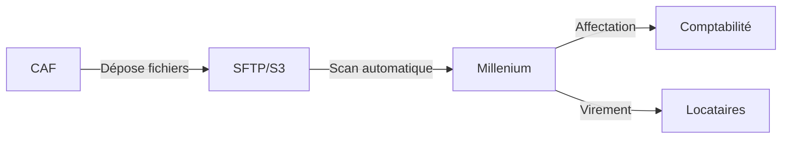
```mermaid
graph LR
    A[CAF] -->|Dépose fichiers| B[SFTP/S3]
    B -->|Scan automatique| C[Millenium]
    C -->|Affectation| D[Comptabilité]
    C -->|Virement| E[Locataires]
```

---

## 🏗️ Architecture globale

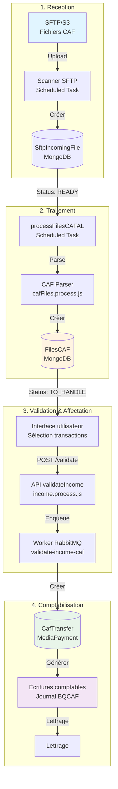
```mermaid
graph TB
    subgraph "1. Réception"
        SFTP[SFTP/S3<br/>Fichiers CAF]
        Scanner[Scanner SFTP<br/>Scheduled Task]
        SftpDB[(SftpIncomingFile<br/>MongoDB)]
    end

    subgraph "2. Traitement"
        ProcessTask[processFilesCAFAL<br/>Scheduled Task]
        Parser[CAF Parser<br/>cafFiles.process.js]
        FilesCAFDB[(FilesCAF<br/>MongoDB)]
    end

    subgraph "3. Validation & Affectation"
        UI[Interface utilisateur<br/>Sélection transactions]
        API[API validateIncome<br/>income.process.js]
        Worker[Worker RabbitMQ<br/>validate-income-caf]
    end

    subgraph "4. Comptabilisation"
        CafTransfer[(CafTransfer<br/>MediaPayment)]
        Accounting[Écritures comptables<br/>Journal BQCAF]
        Lettering[Lettrage]
    end

    SFTP -->|Upload| Scanner
    Scanner -->|Créer| SftpDB
    SftpDB -->|Status: READY| ProcessTask
    ProcessTask -->|Parse| Parser
    Parser -->|Créer| FilesCAFDB
    FilesCAFDB -->|Status: TO_HANDLE| UI
    UI -->|POST /validate| API
    API -->|Enqueue| Worker
    Worker -->|Créer| CafTransfer
    CafTransfer -->|Générer| Accounting
    Accounting -->|Lettrage| Lettering

    style SFTP fill:#e1f5ff
    style FilesCAFDB fill:#fff4e1
    style CafTransfer fill:#e8f5e9
    style Accounting fill:#f3e5f5
```

---

## 🔄 Flux de traitement

### 1️⃣ Phase de réception

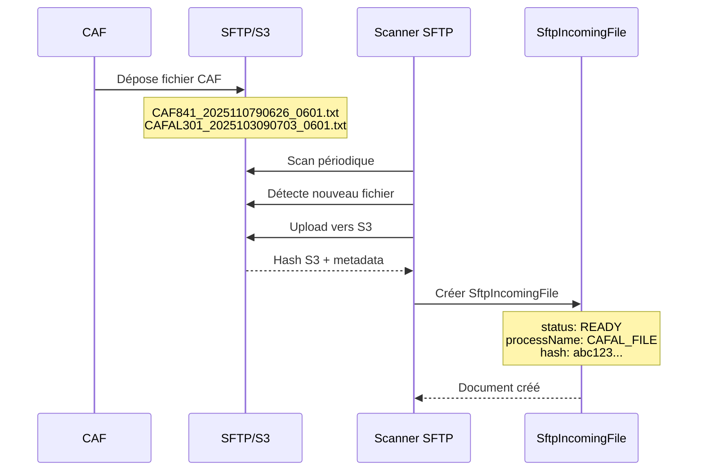
```mermaid
sequenceDiagram
    participant CAF as CAF
    participant SFTP as SFTP/S3
    participant Scanner as Scanner SFTP
    participant DB as SftpIncomingFile

    CAF->>SFTP: Dépose fichier CAF
    Note over SFTP: CAF841_2025110790626_0601.txt<br/>CAFAL301_2025103090703_0601.txt

    Scanner->>SFTP: Scan périodique
    Scanner->>SFTP: Détecte nouveau fichier
    Scanner->>SFTP: Upload vers S3
    SFTP-->>Scanner: Hash S3 + metadata

    Scanner->>DB: Créer SftpIncomingFile
    Note over DB: status: READY<br/>processName: CAFAL_FILE<br/>hash: abc123...

    DB-->>Scanner: Document créé
```

### 2️⃣ Phase de parsing

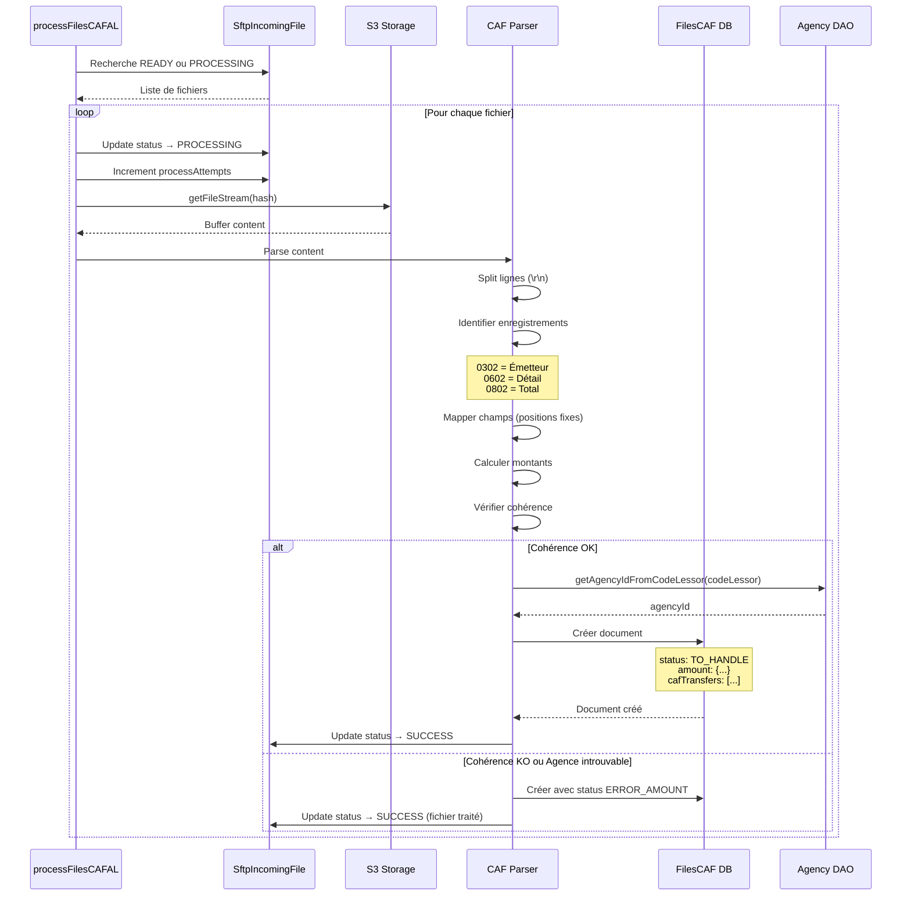
```mermaid
sequenceDiagram
    participant Task as processFilesCAFAL
    participant DB as SftpIncomingFile
    participant S3 as S3 Storage
    participant Parser as CAF Parser
    participant FilesCAF as FilesCAF DB
    participant AgencyDAO as Agency DAO

    Task->>DB: Recherche READY ou PROCESSING
    DB-->>Task: Liste de fichiers

    loop Pour chaque fichier
        Task->>DB: Update status → PROCESSING
        Task->>DB: Increment processAttempts

        Task->>S3: getFileStream(hash)
        S3-->>Task: Buffer content

        Task->>Parser: Parse content

        Parser->>Parser: Split lignes (\r\n)
        Parser->>Parser: Identifier enregistrements
        Note over Parser: 0302 = Émetteur<br/>0602 = Détail<br/>0802 = Total

        Parser->>Parser: Mapper champs (positions fixes)
        Parser->>Parser: Calculer montants
        Parser->>Parser: Vérifier cohérence

        alt Cohérence OK
            Parser->>AgencyDAO: getAgencyIdFromCodeLessor(codeLessor)
            AgencyDAO-->>Parser: agencyId

            Parser->>FilesCAF: Créer document
            Note over FilesCAF: status: TO_HANDLE<br/>amount: {...}<br/>cafTransfers: [...]
            FilesCAF-->>Parser: Document créé

            Parser->>DB: Update status → SUCCESS
        else Cohérence KO ou Agence introuvable
            Parser->>FilesCAF: Créer avec status ERROR_AMOUNT
            Parser->>DB: Update status → SUCCESS (fichier traité)
        end
    end
```

### 3️⃣ Phase de validation utilisateur

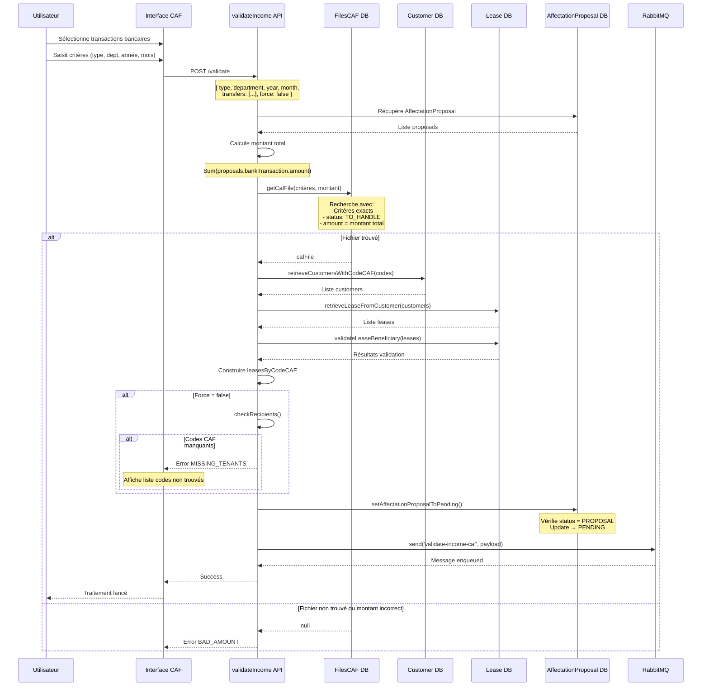
```mermaid
sequenceDiagram
    participant User as Utilisateur
    participant UI as Interface CAF
    participant API as validateIncome API
    participant FilesCAF as FilesCAF DB
    participant Customer as Customer DB
    participant Lease as Lease DB
    participant Affectation as AffectationProposal DB
    participant MQ as RabbitMQ

    User->>UI: Sélectionne transactions bancaires
    User->>UI: Saisit critères (type, dept, année, mois)

    UI->>API: POST /validate
    Note over API: { type, department, year, month,<br/>transfers: [...], force: false }

    API->>Affectation: Récupère AffectationProposal
    Affectation-->>API: Liste proposals

    API->>API: Calcule montant total
    Note over API: Sum(proposals.bankTransaction.amount)

    API->>FilesCAF: getCafFile(critères, montant)
    Note over FilesCAF: Recherche avec:<br/>- Critères exacts<br/>- status: TO_HANDLE<br/>- amount = montant total

    alt Fichier trouvé
        FilesCAF-->>API: cafFile

        API->>Customer: retrieveCustomersWithCodeCAF(codes)
        Customer-->>API: Liste customers

        API->>Lease: retrieveLeaseFromCustomer(customers)
        Lease-->>API: Liste leases

        API->>Lease: validateLeaseBeneficiary(leases)
        Lease-->>API: Résultats validation

        API->>API: Construire leasesByCodeCAF

        alt Force = false
            API->>API: checkRecipients()

            alt Codes CAF manquants
                API-->>UI: Error MISSING_TENANTS
                Note over UI: Affiche liste codes non trouvés
            end
        end

        API->>Affectation: setAffectationProposalToPending()
        Note over Affectation: Vérifie status = PROPOSAL<br/>Update → PENDING

        API->>MQ: send('validate-income-caf', payload)
        MQ-->>API: Message enqueued

        API-->>UI: Success
        UI-->>User: Traitement lancé

    else Fichier non trouvé ou montant incorrect
        FilesCAF-->>API: null
        API-->>UI: Error BAD_AMOUNT
    end
```

### 4️⃣ Phase de traitement asynchrone (Worker)

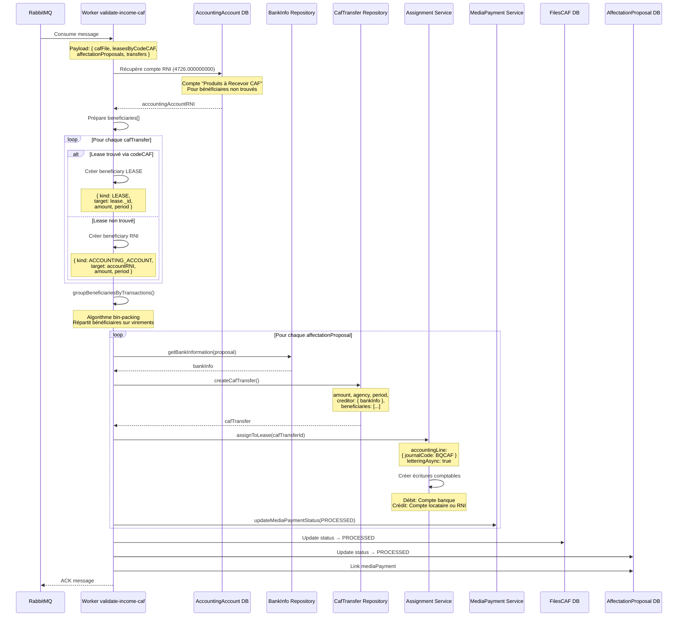
```mermaid
sequenceDiagram
    participant MQ as RabbitMQ
    participant Worker as Worker validate-income-caf
    participant Account as AccountingAccount DB
    participant BankRepo as BankInfo Repository
    participant CafRepo as CafTransfer Repository
    participant Assignment as Assignment Service
    participant MediaPayment as MediaPayment Service
    participant FilesCAF as FilesCAF DB
    participant Affectation as AffectationProposal DB

    MQ->>Worker: Consume message
    Note over Worker: Payload: { cafFile, leasesByCodeCAF,<br/>affectationProposals, transfers }

    Worker->>Account: Récupère compte RNI (4726.000000000)
    Note over Account: Compte "Produits à Recevoir CAF"<br/>Pour bénéficiaires non trouvés
    Account-->>Worker: accountingAccountRNI

    Worker->>Worker: Prépare beneficiaries[]

    loop Pour chaque cafTransfer
        alt Lease trouvé via codeCAF
            Worker->>Worker: Créer beneficiary LEASE
            Note over Worker: { kind: LEASE,<br/>target: lease._id,<br/>amount, period }
        else Lease non trouvé
            Worker->>Worker: Créer beneficiary RNI
            Note over Worker: { kind: ACCOUNTING_ACCOUNT,<br/>target: accountRNI,<br/>amount, period }
        end
    end

    Worker->>Worker: groupBeneficiariesByTransactions()
    Note over Worker: Algorithme bin-packing<br/>Répartit bénéficiaires sur virements

    loop Pour chaque affectationProposal
        Worker->>BankRepo: getBankInformation(proposal)
        BankRepo-->>Worker: bankInfo

        Worker->>CafRepo: createCafTransfer()
        Note over CafRepo: amount, agency, period,<br/>creditor: { bankInfo },<br/>beneficiaries: [...]
        CafRepo-->>Worker: cafTransfer

        Worker->>Assignment: assignToLease(cafTransferId)
        Note over Assignment: accountingLine:<br/>{ journalCode: BQCAF }<br/>letteringAsync: true

        Assignment->>Assignment: Créer écritures comptables
        Note over Assignment: Débit: Compte banque<br/>Crédit: Compte locataire ou RNI

        Worker->>MediaPayment: updateMediaPaymentStatus(PROCESSED)
    end

    Worker->>FilesCAF: Update status → PROCESSED
    Worker->>Affectation: Update status → PROCESSED
    Worker->>Affectation: Link mediaPayment

    Worker-->>MQ: ACK message
```

---

## 💾 Modèle de données

### Collections principales

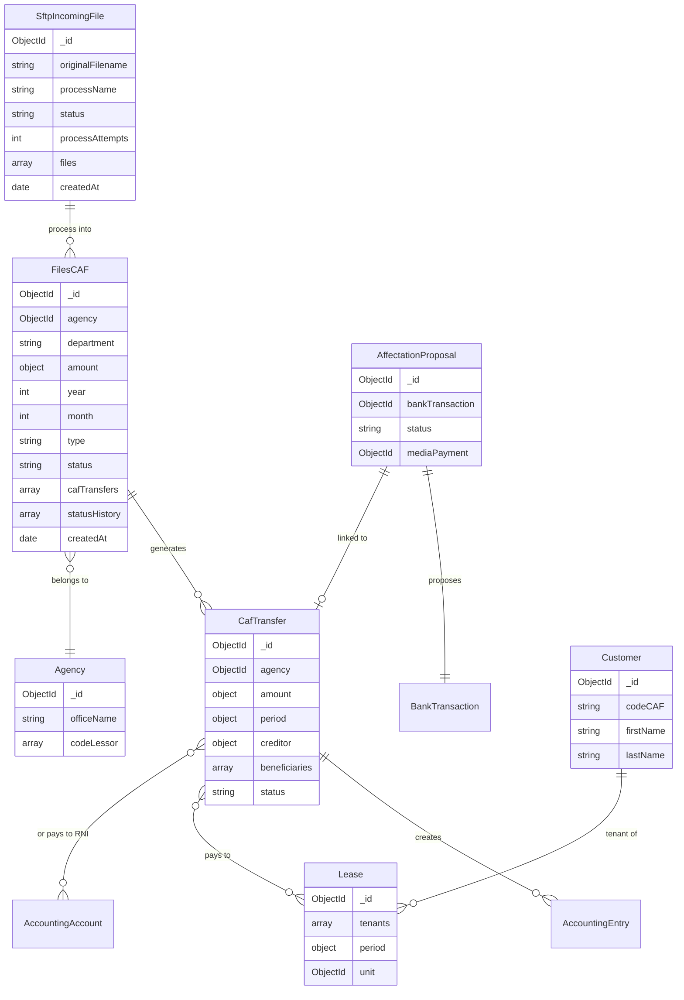
```mermaid
erDiagram
    SftpIncomingFile ||--o{ FilesCAF : "process into"
    FilesCAF ||--o{ CafTransfer : "generates"
    FilesCAF }o--|| Agency : "belongs to"
    CafTransfer ||--o{ AccountingEntry : "creates"
    CafTransfer }o--o{ Lease : "pays to"
    CafTransfer }o--o{ AccountingAccount : "or pays to RNI"
    AffectationProposal ||--|| BankTransaction : "proposes"
    AffectationProposal ||--o| CafTransfer : "linked to"
    Customer ||--o{ Lease : "tenant of"

    SftpIncomingFile {
        ObjectId _id
        string originalFilename
        string processName
        string status
        int processAttempts
        array files
        date createdAt
    }

    FilesCAF {
        ObjectId _id
        ObjectId agency
        string department
        object amount
        int year
        int month
        string type
        string status
        array cafTransfers
        array statusHistory
        date createdAt
    }

    CafTransfer {
        ObjectId _id
        ObjectId agency
        object amount
        object period
        object creditor
        array beneficiaries
        string status
    }

    Agency {
        ObjectId _id
        string officeName
        array codeLessor
    }

    Customer {
        ObjectId _id
        string codeCAF
        string firstName
        string lastName
    }

    Lease {
        ObjectId _id
        array tenants
        object period
        ObjectId unit
    }

    AffectationProposal {
        ObjectId _id
        ObjectId bankTransaction
        string status
        ObjectId mediaPayment
    }
```

### Structure d'un fichier CAF

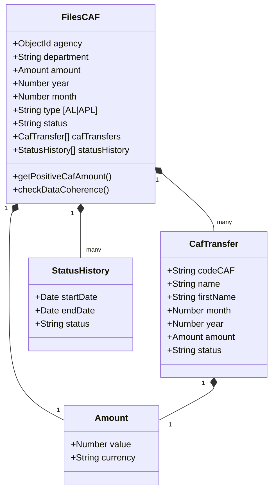
```mermaid
classDiagram
    class FilesCAF {
        +ObjectId agency
        +String department
        +Amount amount
        +Number year
        +Number month
        +String type [AL|APL]
        +String status
        +CafTransfer[] cafTransfers
        +StatusHistory[] statusHistory
        +getPositiveCafAmount()
        +checkDataCoherence()
    }

    class CafTransfer {
        +String codeCAF
        +String name
        +String firstName
        +Number month
        +Number year
        +Amount amount
        +String status
    }

    class Amount {
        +Number value
        +String currency
    }

    class StatusHistory {
        +Date startDate
        +Date endDate
        +String status
    }

    FilesCAF "1" *-- "many" CafTransfer
    FilesCAF "1" *-- "many" StatusHistory
    FilesCAF "1" *-- "1" Amount
    CafTransfer "1" *-- "1" Amount
```

### États et transitions

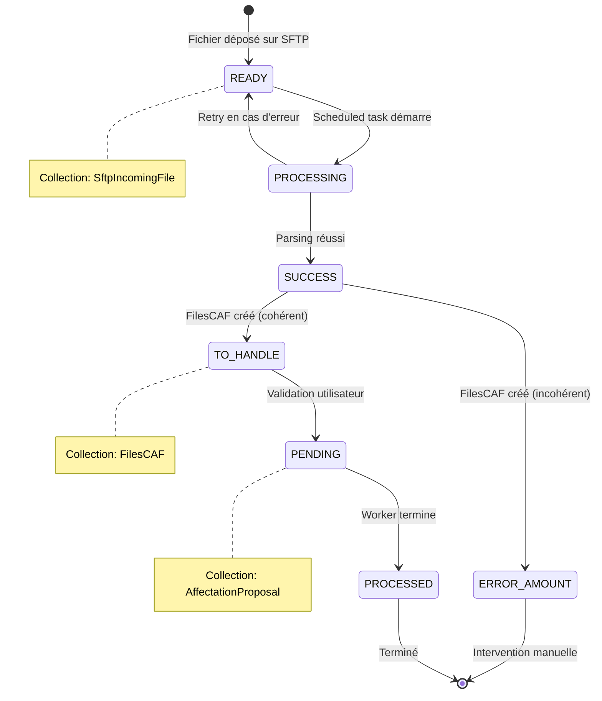
```mermaid
stateDiagram-v2
    [*] --> READY: Fichier déposé sur SFTP
    READY --> PROCESSING: Scheduled task démarre
    PROCESSING --> SUCCESS: Parsing réussi
    PROCESSING --> READY: Retry en cas d'erreur

    SUCCESS --> TO_HANDLE: FilesCAF créé (cohérent)
    SUCCESS --> ERROR_AMOUNT: FilesCAF créé (incohérent)

    TO_HANDLE --> PENDING: Validation utilisateur
    PENDING --> PROCESSED: Worker termine

    ERROR_AMOUNT --> [*]: Intervention manuelle
    PROCESSED --> [*]: Terminé

    note right of READY
        Collection: SftpIncomingFile
    end note

    note right of TO_HANDLE
        Collection: FilesCAF
    end note

    note right of PENDING
        Collection: AffectationProposal
    end note
```

---

## 📊 Format de fichier CAF (positions fixes)

### Structure générale

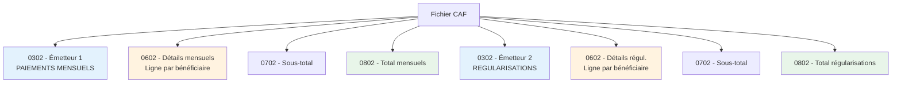
```mermaid
graph TD
    File[Fichier CAF] --> Header1[0302 - Émetteur 1<br/>PAIEMENTS MENSUELS]
    File --> Details1[0602 - Détails mensuels<br/>Ligne par bénéficiaire]
    File --> SubTotal1[0702 - Sous-total]
    File --> Total1[0802 - Total mensuels]

    File --> Header2[0302 - Émetteur 2<br/>REGULARISATIONS]
    File --> Details2[0602 - Détails régul.<br/>Ligne par bénéficiaire]
    File --> SubTotal2[0702 - Sous-total]
    File --> Total2[0802 - Total régularisations]

    style Header1 fill:#e3f2fd
    style Header2 fill:#e3f2fd
    style Details1 fill:#fff3e0
    style Details2 fill:#fff3e0
    style Total1 fill:#e8f5e9
    style Total2 fill:#e8f5e9
```

### Enregistrement 0302 (Émetteur)

```
Position: 0    4  7 9    15   20 22 24                                     113
          |    |  | |    |    |  |  |                                      |
          0302 999 84 P8456   11 25 CAISSE D'ALLOCATIONS FAM...MENSUELS
          │    │   │  │       │  │  │
          │    │   │  │       │  │  └─ Description
          │    │   │  │       │  └─ Année (2 chiffres)
          │    │   │  │       └─ Mois
          │    │   │  └─ Code bailleur → mapping Agency
          │    │   └─ Département
          │    └─ Type (999=AL, 900=APL)
          └─ Préfixe émetteur
```

### Enregistrement 0602 (Détail)

```
Position: 0    4  7 9    15                36               51           71           83 85 87                 91          102          113
          |    |  | |    |                 |                |            |            |  |  |                  |           |            |
          0602 999 84 P8456 ... 000000726118400000001422146L DE ALBERTIS     MEHDI       25 10    0000002187500000001625000
          │    │   │  │                    │                │            │            │  │  │    │           │
          │    │   │  │                    │                │            │            │  │  │    │           └─ Retenue (11c, centimes)
          │    │   │  │                    │                │            │            │  │  │    └─ Montant (11c, centimes)
          │    │   │  │                    │                │            │            │  │  └─ Mois période
          │    │   │  │                    │                │            │            │  └─ Année période (2c)
          │    │   │  │                    │                │            │            └─ Prénom (12c)
          │    │   │  │                    │                │            └─ Nom (20c)
          │    │   │  │                    │                └─ Code CAF (15c) → Customer.codeCAF
          │    │   │  │                    └─ Padding
          │    │   │  └─ Code bailleur
          │    │   └─ Département
          │    └─ Type
          └─ Préfixe détail
```

### Enregistrement 0802 (Total)

```
Position: 0    4                                                          91          102          113
          |    |                                                          |           |            |
          0802 999 84 ... 0000570000129007500000001625
          │    │   │       │           │
          │    │   │       │           └─ Total retenues (11c, centimes)
          │    │   │       └─ Total montants (11c, centimes)
          │    │   └─ Département
          │    └─ Type
          └─ Préfixe total
```

---

## 🔍 Processus de mapping

### 1. Code bailleur → Agence

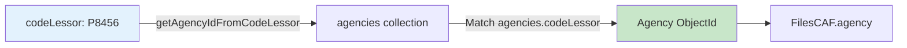
```mermaid
graph LR
    A[codeLessor: P8456] -->|getAgencyIdFromCodeLessor| B[agencies collection]
    B -->|Match agencies.codeLessor| C[Agency ObjectId]
    C --> D[FilesCAF.agency]

    style A fill:#e3f2fd
    style C fill:#c8e6c9
```

### 2. Code CAF → Locataire

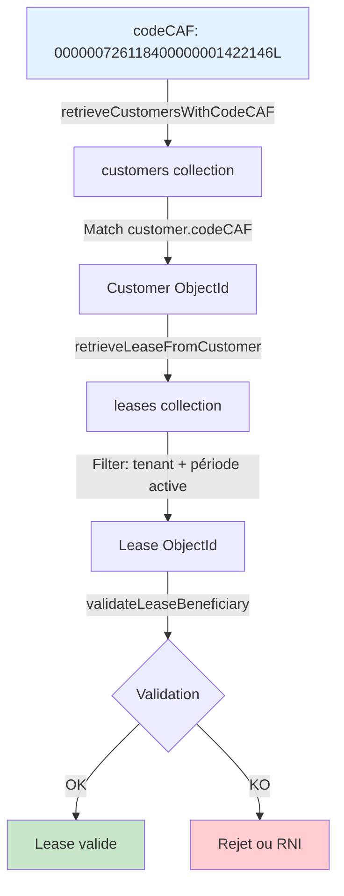
```mermaid
graph TB
    A[codeCAF: 000000726118400000001422146L] -->|retrieveCustomersWithCodeCAF| B[customers collection]
    B -->|Match customer.codeCAF| C[Customer ObjectId]

    C -->|retrieveLeaseFromCustomer| D[leases collection]
    D -->|Filter: tenant + période active| E[Lease ObjectId]

    E -->|validateLeaseBeneficiary| F{Validation}
    F -->|OK| G[Lease valide]
    F -->|KO| H[Rejet ou RNI]

    style A fill:#e3f2fd
    style G fill:#c8e6c9
    style H fill:#ffcdd2
```

### 3. Répartition bénéficiaires → Transactions

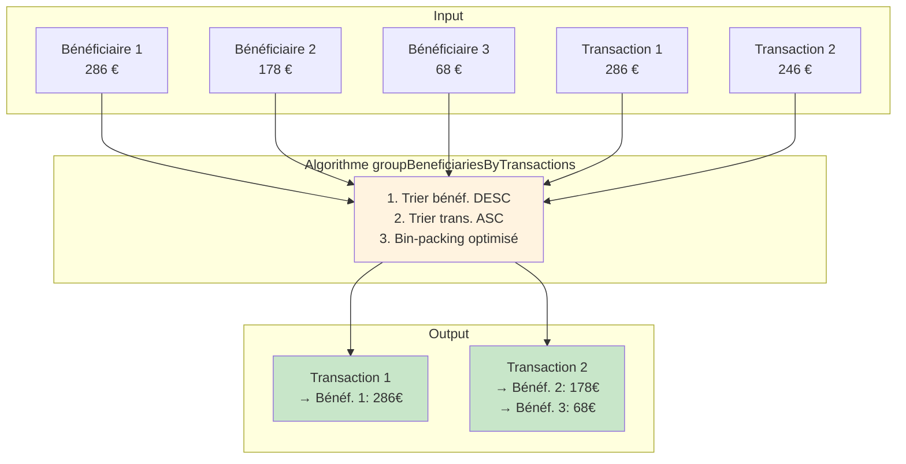
```mermaid
graph TB
    subgraph "Input"
        B1[Bénéficiaire 1<br/>286 €]
        B2[Bénéficiaire 2<br/>178 €]
        B3[Bénéficiaire 3<br/>68 €]
        T1[Transaction 1<br/>286 €]
        T2[Transaction 2<br/>246 €]
    end

    subgraph "Algorithme groupBeneficiariesByTransactions"
        Algo[1. Trier bénéf. DESC<br/>2. Trier trans. ASC<br/>3. Bin-packing optimisé]
    end

    subgraph "Output"
        R1[Transaction 1<br/>→ Bénéf. 1: 286€]
        R2[Transaction 2<br/>→ Bénéf. 2: 178€<br/>→ Bénéf. 3: 68€]
    end

    B1 --> Algo
    B2 --> Algo
    B3 --> Algo
    T1 --> Algo
    T2 --> Algo

    Algo --> R1
    Algo --> R2

    style Algo fill:#fff3e0
    style R1 fill:#c8e6c9
    style R2 fill:#c8e6c9
```

---

## ⚠️ Gestion des erreurs

### Types d'erreurs et résolutions

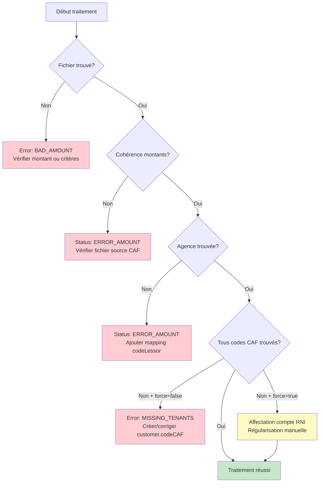
```mermaid
graph TD
    Start[Début traitement] --> Check1{Fichier trouvé?}
    Check1 -->|Non| E1[Error: BAD_AMOUNT<br/>Vérifier montant ou critères]
    Check1 -->|Oui| Check2{Cohérence montants?}

    Check2 -->|Non| E2[Status: ERROR_AMOUNT<br/>Vérifier fichier source CAF]
    Check2 -->|Oui| Check3{Agence trouvée?}

    Check3 -->|Non| E3[Status: ERROR_AMOUNT<br/>Ajouter mapping codeLessor]
    Check3 -->|Oui| Check4{Tous codes CAF trouvés?}

    Check4 -->|Non + force=false| E4[Error: MISSING_TENANTS<br/>Créer/corriger customer.codeCAF]
    Check4 -->|Non + force=true| RNI[Affectation compte RNI<br/>Régularisation manuelle]
    Check4 -->|Oui| Success[Traitement réussi]

    RNI --> Success

    style E1 fill:#ffcdd2
    style E2 fill:#ffcdd2
    style E3 fill:#ffcdd2
    style E4 fill:#ffcdd2
    style RNI fill:#fff9c4
    style Success fill:#c8e6c9
```

### Matrice des erreurs

| Code erreur | Collection | Cause | Action utilisateur |
|-------------|------------|-------|-------------------|
| `BAD_AMOUNT` | - | Montant transactions ≠ fichier CAF | Vérifier sélection transactions |
| `ERROR_AMOUNT` | FilesCAF | Total ≠ somme des lignes | Contacter CAF, vérifier fichier |
| `ERROR_AMOUNT` | FilesCAF | Agence non trouvée | Ajouter mapping dans `agencies.codeLessor` |
| `MISSING_TENANTS` | - | Codes CAF non trouvés | Créer/corriger `customer.codeCAF` |
| `ALREADY_PROCESSED` | AffectationProposal | Status ≠ PROPOSAL | Fichier déjà traité |
| `ERROR_SUBSIDY_RECIPIENT_UNKNOWN` | CafTransfer | Locataire non trouvé (avec force) | Régulariser compte RNI 4726 |

---

## 🎓 Points clés

### 1. Matching montant exact

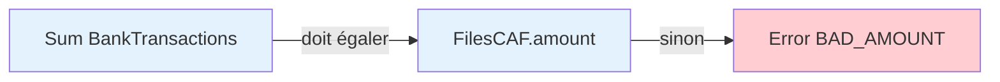
```mermaid
graph LR
    A[Sum BankTransactions] -->|doit égaler| B[FilesCAF.amount]
    B -->|sinon| C[Error BAD_AMOUNT]

    style A fill:#e3f2fd
    style B fill:#e3f2fd
    style C fill:#ffcdd2
```

### 2. Code CAF critique

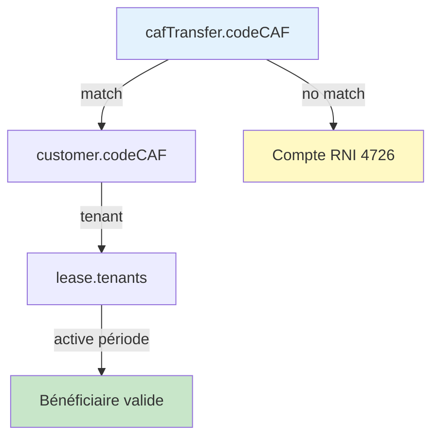
```mermaid
graph TB
    CAF[cafTransfer.codeCAF] -->|match| Customer[customer.codeCAF]
    Customer -->|tenant| Lease[lease.tenants]
    Lease -->|active période| Valid[Bénéficiaire valide]

    CAF -->|no match| RNI[Compte RNI 4726]

    style CAF fill:#e3f2fd
    style Valid fill:#c8e6c9
    style RNI fill:#fff9c4
```

### 3. Période décalée

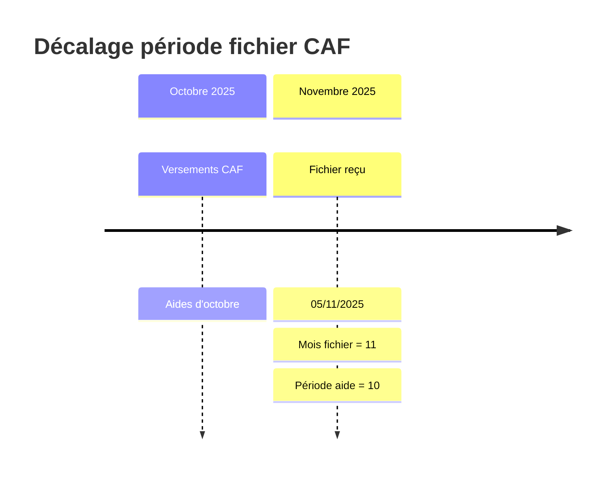
```mermaid
timeline
    title Décalage période fichier CAF
    section Octobre 2025
        Versements CAF : Aides d'octobre
    section Novembre 2025
        Fichier reçu : 05/11/2025
        : Mois fichier = 11
        : Période aide = 10
```

### 4. Traitement asynchrone

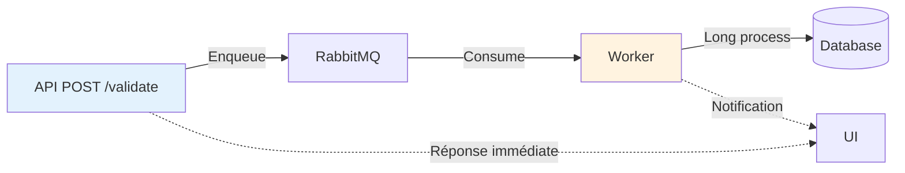
```mermaid
graph LR
    API[API POST /validate] -->|Enqueue| MQ[RabbitMQ]
    MQ -->|Consume| Worker[Worker]
    Worker -->|Long process| DB[(Database)]

    API -.->|Réponse immédiate| UI[UI]
    Worker -.->|Notification| UI

    style API fill:#e3f2fd
    style Worker fill:#fff3e0
```

### 5. Fallback RNI

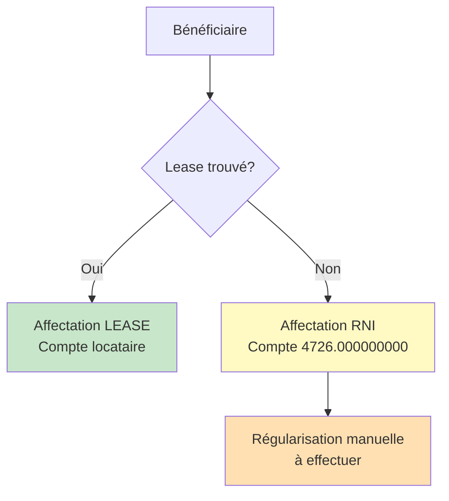
```mermaid
graph TB
    B[Bénéficiaire] --> C{Lease trouvé?}
    C -->|Oui| L[Affectation LEASE<br/>Compte locataire]
    C -->|Non| R[Affectation RNI<br/>Compte 4726.000000000]

    R --> M[Régularisation manuelle<br/>à effectuer]

    style L fill:#c8e6c9
    style R fill:#fff9c4
    style M fill:#ffe0b2
```

### 6. ⚠️ Règle de cohérence montants pour affectations Transfer CAF

> **IMPORTANT** : Cette règle est critique pour la réconciliation comptable.

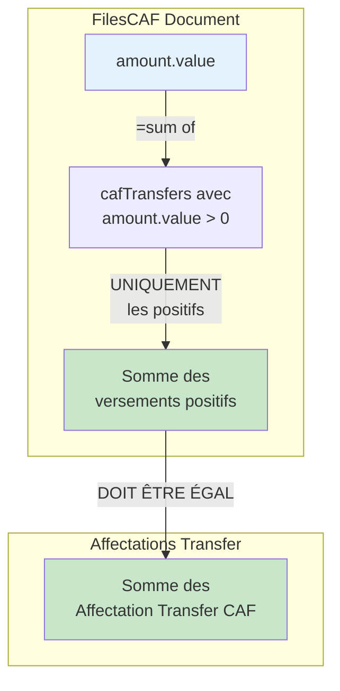
```mermaid
graph TB
    subgraph "FilesCAF Document"
        A[amount.value] -->|"=sum of"| B[cafTransfers avec<br/>amount.value > 0]
        B -->|"UNIQUEMENT<br/>les positifs"| C[Somme des<br/>versements positifs]
    end

    subgraph "Affectations Transfer"
        D[Somme des<br/>Affectation Transfer CAF]
    end

    C -->|"DOIT ÊTRE ÉGAL"| D

    style A fill:#e3f2fd
    style C fill:#c8e6c9
    style D fill:#c8e6c9
```

**Règle :**
- `FilesCAF.amount.value` = **Somme des `cafTransfers[].amount.value` où `amount.value > 0`**
- Cette somme (uniquement les montants **positifs**) doit correspondre exactement à la somme des **Affectation Transfer CAF**
- Les montants **négatifs** (retenues) sont traités séparément et ne rentrent pas dans le calcul du total

**Exemple concret :**

```javascript
// FilesCAF document
{
  amount: { value: 16639251, currency: "EUR" }, // = 166 392,51 €
  cafTransfers: [
    { amount: { value: 21875 }, ... },   // +218,75 € (versement)
    { amount: { value: -1625 }, ... },   // -16,25 € (retenue - NON COMPTÉE dans le total)
    { amount: { value: 45000 }, ... },   // +450,00 € (versement)
    // ... autres transfers
  ]
}

// Vérification
const sumPositive = cafTransfers
  .filter(t => t.amount.value > 0)
  .reduce((sum, t) => sum + t.amount.value, 0);

// sumPositive DOIT ÉGALER amount.value (16639251)
// sumPositive DOIT ÉGALER la somme des Affectation Transfer CAF
```

**Si incohérence :**
- Vérifier le fichier source CAF
- Vérifier les retenues (montants négatifs)
- Contacter la CAF si le total ne correspond pas

---

## 📚 Références code source

### Flux principal

| Fichier | Description | Rôle |
|---------|-------------|------|
| `/applications/plato/src/flux/technical/scanSftp/scanS3.process.js` | Scanner SFTP | Détecte et importe fichiers |
| `/applications/plato/src/flux/caf/cafFiles.process.js` | Parser CAF | Parse et valide fichiers |
| `/applications/plato/src/jobs/schedulers/tasks/processFilesCAFAL.ts` | Scheduled Task | Orchestre le parsing |
| `/applications/plato/src/routes/accounting/rentalManagement/caf/income/income.process.js` | Validation & Worker | Valide et traite comptablement |

### Constantes et mapping

| Fichier | Contenu |
|---------|---------|
| `/applications/plato/constants/accounting/filesCAF.ts` | Mapping positions champs, status, types |
| `/applications/plato/constants/flux/sftpIncomingFile/filesMetadata.ts` | Regex reconnaissance fichiers |
| `/applications/plato/constants/scheduledTasks.ts` | Nom des tâches planifiées |

### DAO et services

| Fichier | Description |
|---------|-------------|
| `/applications/plato/src/services/dao/cafFiles.dao.js` | CRUD FilesCAF |
| `/applications/plato/src/services/dao/agency.dao.js` | Mapping codeLessor → Agency |
| `/applications/plato/src/services/accounting/assignment.js` | Affectation et écritures |

---

## 🔧 Outils utiles

### Script de parsing

```bash
# Parser les fichiers CAF en JSON
node /Users/frx33355/Documents/dev/mcp/scripts/parse-caf-to-json.js

# Afficher résumé
node /Users/frx33355/Documents/dev/mcp/scripts/parse-caf-files.js
```

### Requêtes MongoDB

```javascript
// Fichiers en attente
db.filesCAF.find({ status: 'TO_HANDLE' }).sort({ createdAt: -1 })

// Vérifier cohérence
db.filesCAF.aggregate([
  { $match: { _id: ObjectId('...') } },
  { $project: {
      totalFile: '$amount.value',
      totalLines: { $sum: '$cafTransfers.amount.value' },
      diff: { $subtract: ['$amount.value', { $sum: '$cafTransfers.amount.value' }] }
  }}
])

// Codes CAF non trouvés
db.filesCAF.aggregate([
  { $match: { status: 'TO_HANDLE' } },
  { $unwind: '$cafTransfers' },
  { $lookup: {
      from: 'customers',
      localField: 'cafTransfers.codeCAF',
      foreignField: 'codeCAF',
      as: 'customer'
  }},
  { $match: { customer: { $size: 0 } } },
  { $project: {
      codeCAF: '$cafTransfers.codeCAF',
      name: '$cafTransfers.name',
      firstName: '$cafTransfers.firstName',
      amount: '$cafTransfers.amount.value'
  }}
])

// Statistiques par département
db.filesCAF.aggregate([
  { $match: { createdAt: { $gte: ISODate('2025-01-01') } } },
  { $group: {
      _id: '$department',
      count: { $sum: 1 },
      totalAmount: { $sum: '$amount.value' },
      avgAmount: { $avg: '$amount.value' }
  }},
  { $sort: { totalAmount: -1 } }
])
```

---

## ✅ Checklist d'intégration

```mermaid
graph TB
    Start([Début]) --> C1{Fichier sur SFTP?}
    C1 -->|Non| A1[Demander à CAF]
    C1 -->|Oui| C2{SftpIncomingFile créé?}

    C2 -->|Non| A2[Vérifier scanner SFTP]
    C2 -->|Oui| C3{Status = SUCCESS?}

    C3 -->|Non| A3[Vérifier logs processFilesCAFAL]
    C3 -->|Oui| C4{FilesCAF créé?}

    C4 -->|Non| A4[Vérifier logs parsing]
    C4 -->|Oui| C5{Status = TO_HANDLE?}

    C5 -->|Non = ERROR_AMOUNT| A5[Vérifier cohérence ou mapping agence]
    C5 -->|Oui| C6{Agence mappée?}

    C6 -->|Non| A6[Ajouter dans agencies.codeLessor]
    C6 -->|Oui| C7{Transactions bancaires?}

    C7 -->|Non| A7[Attendre rapprochement bancaire]
    C7 -->|Oui| C8{Montant match?}

    C8 -->|Non| A8[Ajuster sélection transactions]
    C8 -->|Oui| C9{Codes CAF trouvés?}

    C9 -->|Non| A9{Utiliser force?}
    A9 -->|Non| A10[Créer/corriger customer.codeCAF]
    A9 -->|Oui| A11[RNI - Régularisation manuelle]
    C9 -->|Oui| C10[POST /validate]
    A11 --> C10

    C10 --> C11{Worker traité?}
    C11 -->|Non| A12[Vérifier logs RabbitMQ]
    C11 -->|Oui| C12{Écritures créées?}

    C12 -->|Non| A13[Vérifier logs assignment]
    C12 -->|Oui| C13{Status = PROCESSED?}

    C13 -->|Non| A14[Vérifier status update]
    C13 -->|Oui| End([Terminé ✅])

    style End fill:#c8e6c9
    style A1 fill:#ffcdd2
    style A2 fill:#ffcdd2
    style A3 fill:#ffcdd2
    style A4 fill:#ffcdd2
    style A5 fill:#ffcdd2
    style A6 fill:#ffcdd2
    style A7 fill:#fff9c4
    style A8 fill:#ffcdd2
    style A9 fill:#fff9c4
    style A10 fill:#ffcdd2
    style A11 fill:#fff9c4
    style A12 fill:#ffcdd2
    style A13 fill:#ffcdd2
    style A14 fill:#ffcdd2
```

---

## 📈 Métriques et monitoring

### KPIs à surveiller

```mermaid
graph TB
    subgraph "Performance"
        M1[Temps traitement<br/>parsing]
        M2[Temps traitement<br/>worker]
        M3[Taux de réussite<br/>première passe]
    end

    subgraph "Qualité"
        M4[% Fichiers ERROR_AMOUNT]
        M5[% Codes CAF trouvés]
        M6[% Affectation RNI]
    end

    subgraph "Business"
        M7[Montant mensuel traité]
        M8[Nombre bénéficiaires]
        M9[Délai traitement moyen]
    end

    style M1 fill:#e3f2fd
    style M2 fill:#e3f2fd
    style M3 fill:#e3f2fd
    style M4 fill:#fff3e0
    style M5 fill:#fff3e0
    style M6 fill:#fff3e0
    style M7 fill:#e8f5e9
    style M8 fill:#e8f5e9
    style M9 fill:#e8f5e9
```

### Alertes recommandées

| Condition | Seuil | Action |
|-----------|-------|--------|
| Fichiers en TO_HANDLE > 24h | > 5 | Vérifier sélection utilisateur |
| Taux ERROR_AMOUNT | > 10% | Vérifier mapping agences |
| Codes CAF non trouvés | > 20% | Audit customer.codeCAF |
| Worker en erreur | > 3 échecs | Alerter équipe tech |
| Affectation RNI | > 30% | Audit données customers |

---

## 🔐 Sécurité et permissions

### Permissions requises

```mermaid
graph TB
    User[Utilisateur] --> P1{Voir fichiers CAF?}
    P1 -->|Oui| R1[Read FilesCAF]

    User --> P2{Valider encaissement?}
    P2 -->|Oui| R2[Write CafTransfer<br/>Update AffectationProposal]

    User --> P3{Accès comptabilité?}
    P3 -->|Oui| R3[Read/Write AccountingEntry]

    style R1 fill:#e3f2fd
    style R2 fill:#fff3e0
    style R3 fill:#e8f5e9
```

### Audit trail

| Action | Collection | Champ tracé |
|--------|------------|-------------|
| Création fichier | FilesCAF | createdAt, statusHistory |
| Validation utilisateur | AffectationProposal | status, updatedAt |
| Traitement worker | CafTransfer | createdAt |
| Écriture comptable | AccountingEntry | createdAt, userContext |

---

**Fin du document** - Pour toute question : consulter `/docs/integration-fichiers-caf.md`
